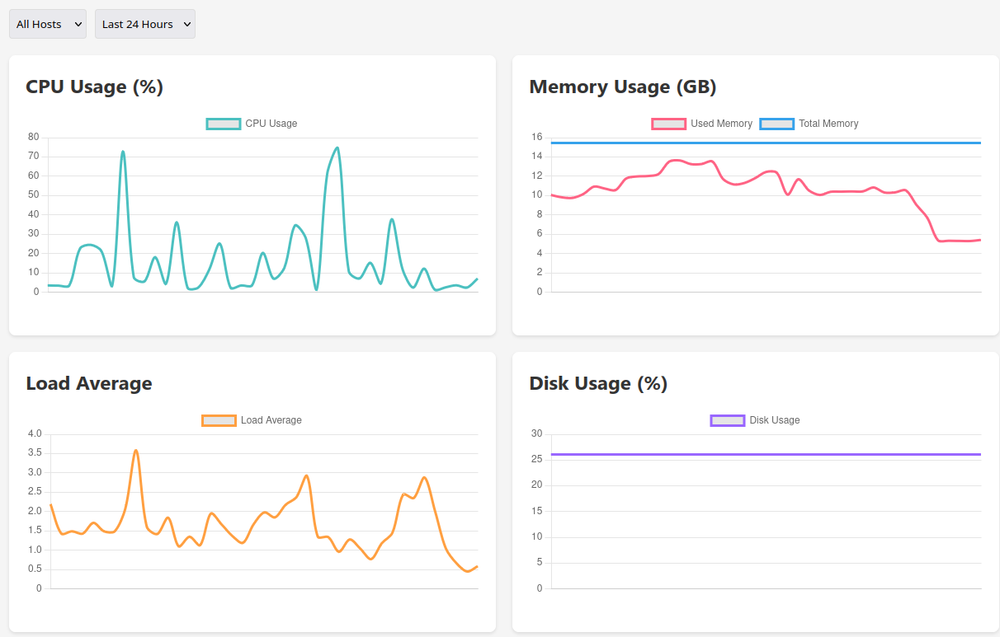

# cf-worker-probe

Serverless vps probe for your server. Based on cloudflare worker && d1 && page, no-deps. Easy to deploy.

## Usage

first deploy the worker && set the db.

### dashboard/index.html

```js
const WORKER_URL = 'YOUR_WORKER_URL';
```

deploy the dashboard to cloudflare page(just drag and drop)

### client.sh

```sh
WORKER_URL="HERE_YOUR_WORKER_URL"
```

run client.sh on your vps, you can make a systemd service if you want.

that's all

---

install inetutils if missing hostname command.

## Screen shot


